# UI Changes 

## Overview

### Full Pink Theme
- **5-tone family**: coral (`#f43f5e`) → pink (`#ec4899`) → fuchsia (`#d946ef`) → light pink (`#f9a8d4`) → alert rose
- **Background**: `#fdf6f9`

### NavBar.jsx
- Returns `null` → Header has been removed.

### Sidebar.jsx
- Removed the following sections:
  - **Top Selling Products** (on the Reports page)
  - **Deleted Items** (on the Products page)

---

## Dashboard

**Before**  
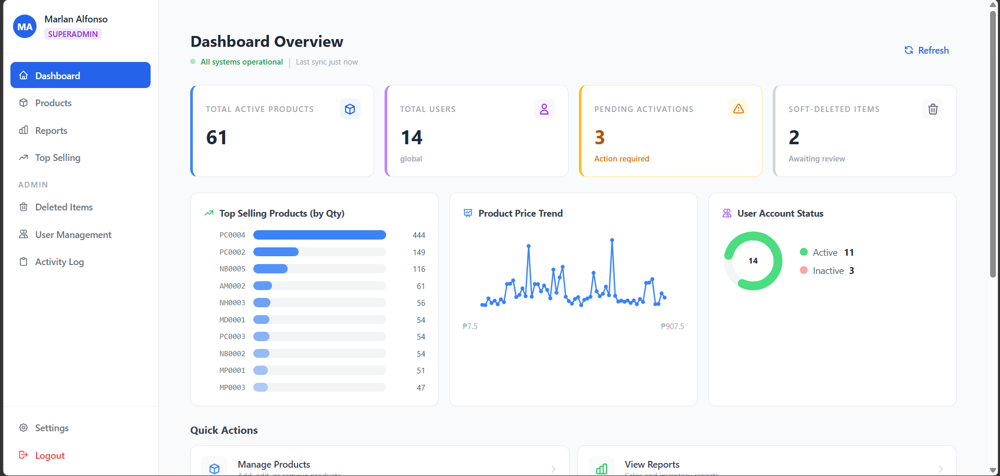

**After**  
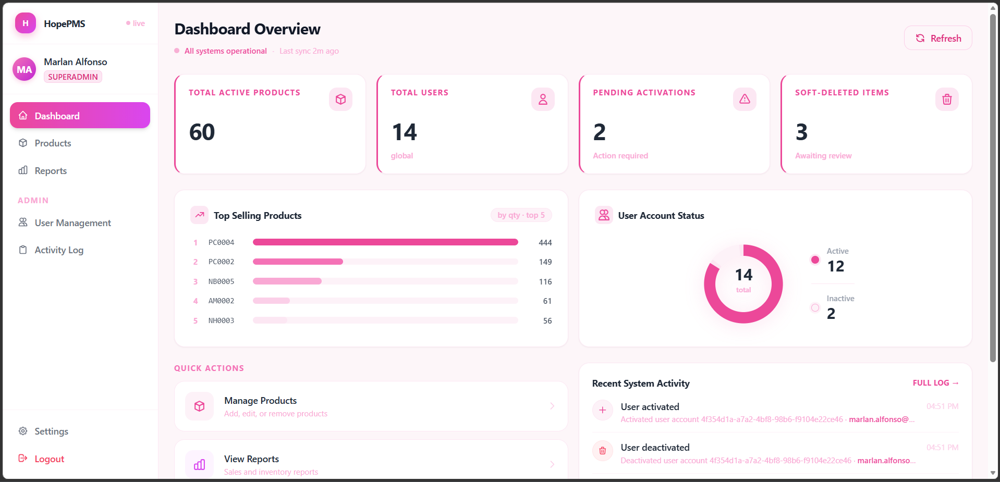

### Changes Made
- Replaced emoji icons in **MetricCard** with the same SVG icons used in the sidebar.
- Replaced emoji icons in **QuickAction** with SVG icons.
- Bar chart colors made more uniform using the pink 5-tone palette.
- **Top Selling Products (by Qty)** — limited to Top 5 only.
- Removed the **Product Price Trend** section.

---

## Products

**Before**  
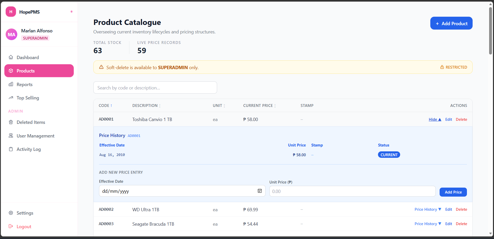

**After**  
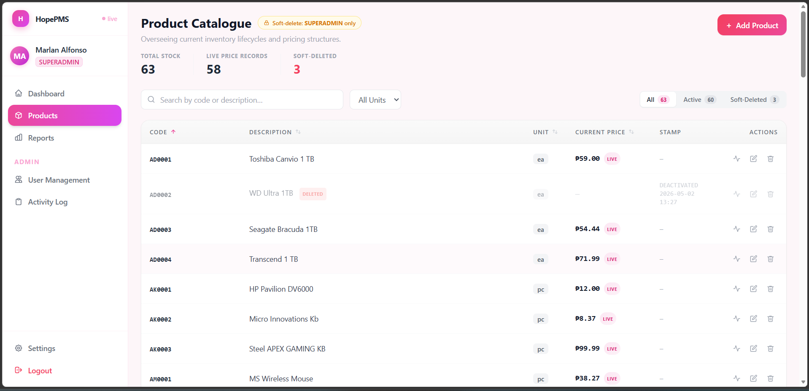  
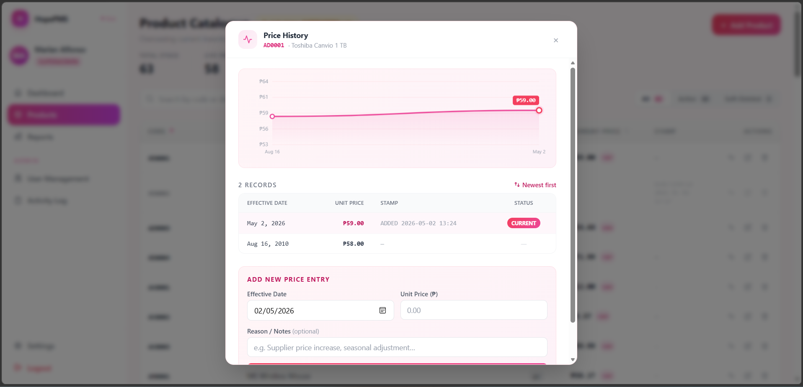  
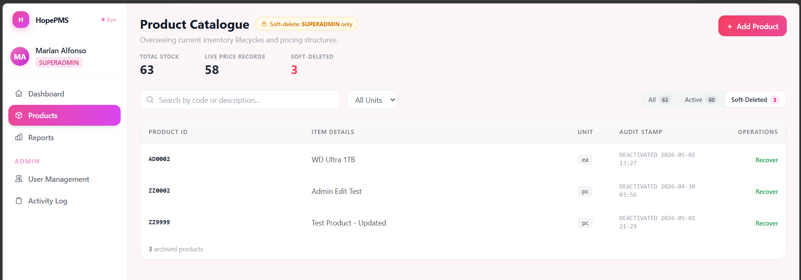

### Changes Made

#### New File
- **`src/components/products/PriceHistoryModal.jsx`**
  - Proper modal with backdrop-blur overlay
  - Animated Line Chart
  - Records table with sort toggle (newest/oldest) and pink **CURRENT** badge
  - Embedded **Add New Price Entry** form with optional **Reason/Notes** field
  - `effdate` defaults to today
  - Close via Escape key or backdrop click

#### Updated: `ProductsPage.jsx`
- Clickable rows open **Price History Modal** (`e.stopPropagation()` on action column)
- Replaced text links with SVG icon buttons (history/pencil/trash) with colored hover states
- Bold current price with pink **LIVE** badge
- Added **All / Active / Soft-Deleted** tabs with live counts
- Unit filter dropdown beside search
- Soft-delete banner replaced with a compact inline pill badge
- Pink spinner and gradient **Add Product** button
- Table footer showing record count + "Click any row" hint
- Removed the old inline `PriceHistoryPanel` row expansion
- Soft Delete is only visible for **ADMIN** & **SUPERADMIN**

#### Other Updates
- `AddProductModal`, `EditProductModal`, `SoftDeleteConfirmDialog`
  - All modals now use `rounded-2xl`, backdrop-blur-sm, pink focus rings, and gradient confirm buttons
  - Consistent header pattern with pink-tinted icon
- `LoadingSpinner` color changed to `border-pink-400`
- Added recover logic to the **Soft-Deleted** tab

> **Note**: `PriceHistoryPanel.jsx`, `DeletedItemsPage.jsx`, and `AddPriceEntryForm.jsx` can now be deleted (logic consolidated into the modal).

---

## Reports

**Before**  
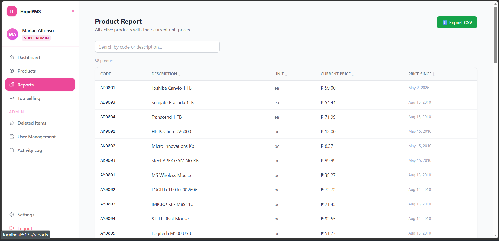  
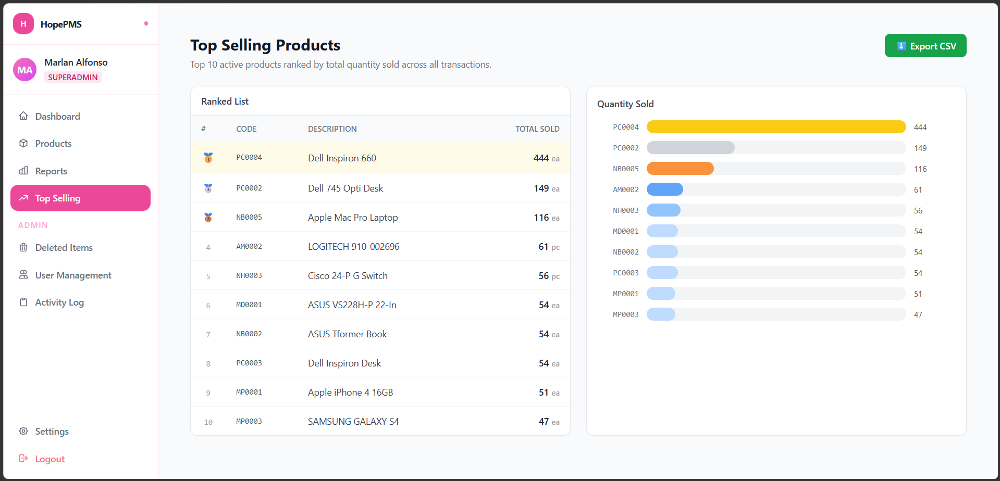

**After**  
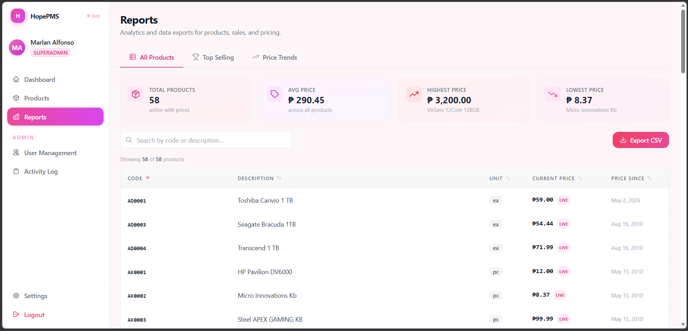  
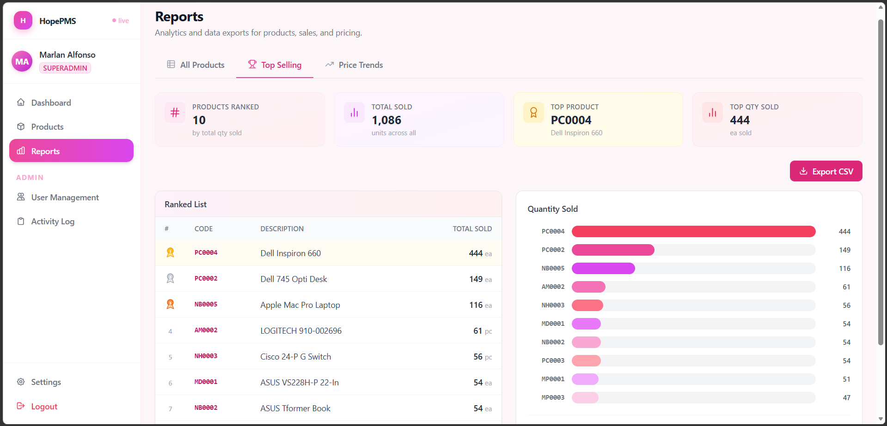  
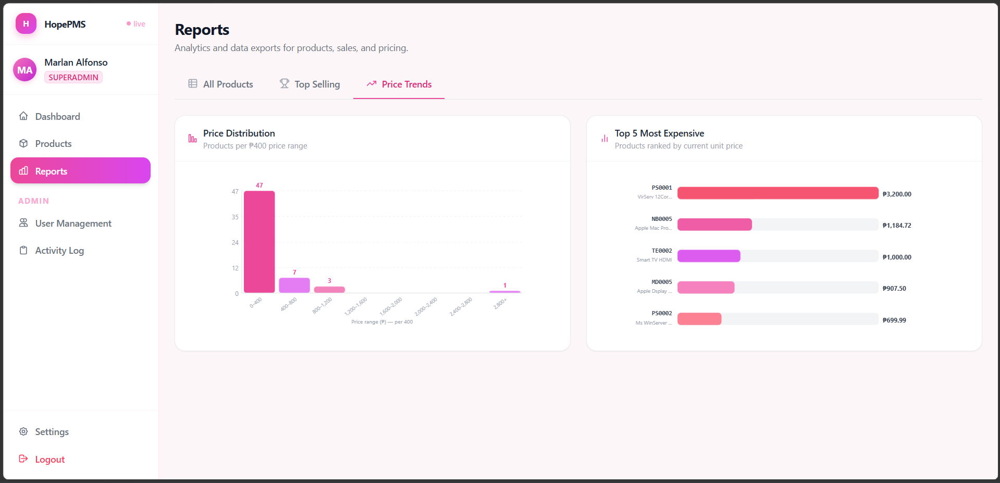

### Changes Made

- **`src/pages/ProductReportPage.jsx`**
  - Converted into a tabbed interface (router + shell)

#### Tab 1: `ReportTabAllProducts.jsx`
- Same fetch logic as the old Product Report
- Added 4 summary cards (Total Products, Avg Price, Highest, Lowest)
- Pink search/export styling

#### Tab 2: `ReportTabTopSelling.jsx`
- Same fetch logic as old Top Selling page
- Added 4 summary cards (Products Ranked, Total Sold, Top Product, Top Qty)
- Replaced emoji medals with SVG medals
- Updated bar colors to the pink 5-tone family

#### Tab 3: `ReportTabPriceTrends.jsx`
- Fetches from `getProductReport()` + `getPriceTrendData()`
- Two charts (no new library):
  - Price distribution histogram
  - Top 5 most expensive products (horizontal bars)

---

## User Management

**Before**  
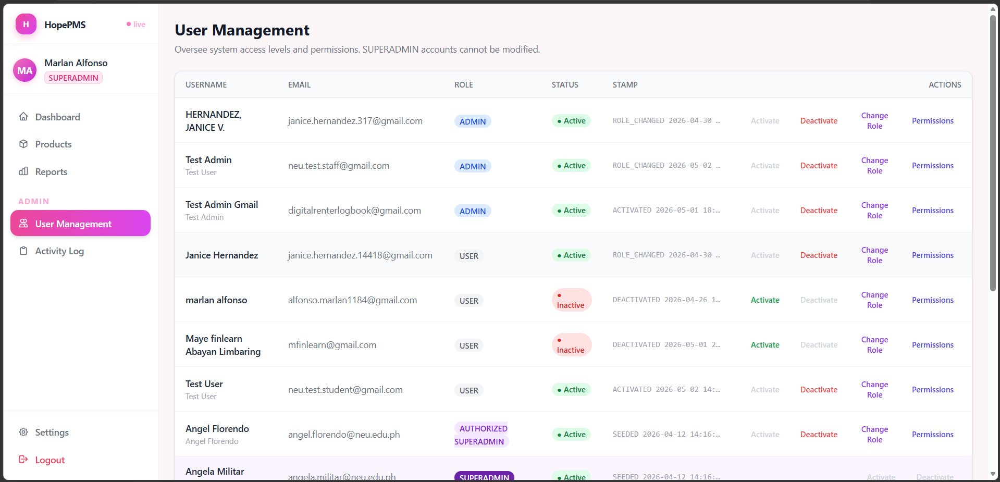

**After**  
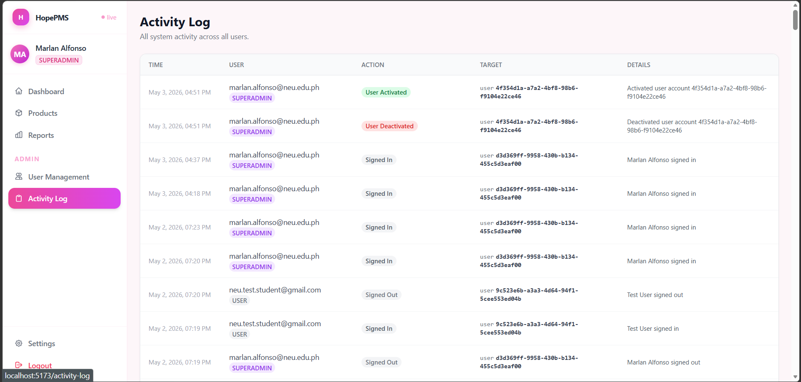

### Changes Made (`src/pages/UserManagementPage.jsx`)

- **Tabs**: Active / Inactive with live count badges
- Removed **Status** column entirely
- Active tab shows **Deactivate**, Inactive tab shows **Activate**
- Username is now `font-bold text-gray-800`
- Role badges consistently sized with `font-semibold`
- All action buttons are now **28×28px icon-only** with hover color rings + tooltips
- Superadmin rows get `opacity-60`, gear icon, and restricted tooltip
- Search + Role filter + improved empty state

---

## Activity Log

**Before**  
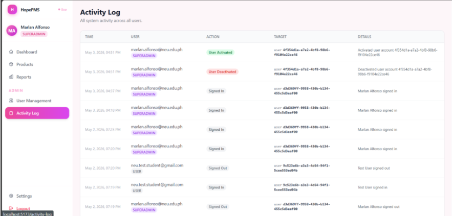

**After**  
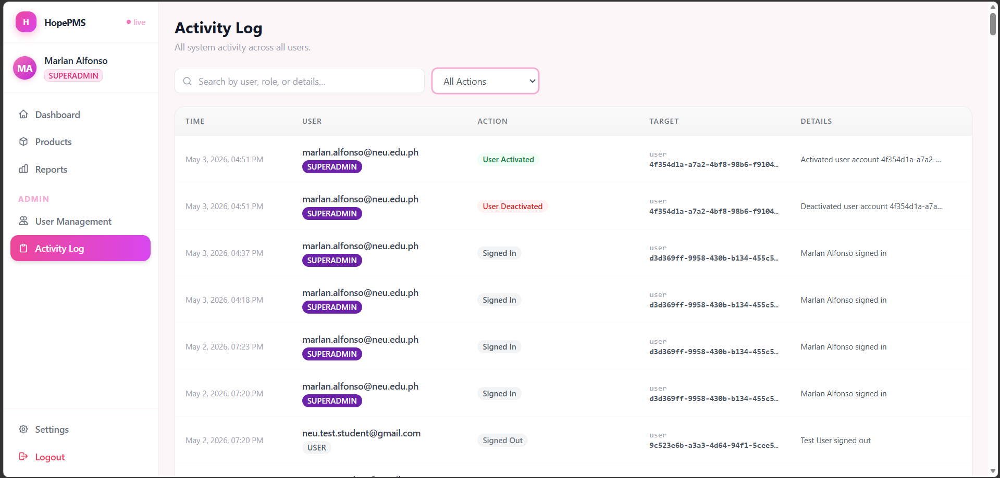

### Changes Made (`src/pages/ActivityLogPage.jsx`)

- Consistent table header and structure
- Improved **ActionBadge** styling (`font-semibold`, softer tint colors)
- Added **RoleBadge** component
- Search input with icon + dynamic "All Actions" dropdown
- Footer updated to match other tables

---

## Login & Landing Page

**Before**  
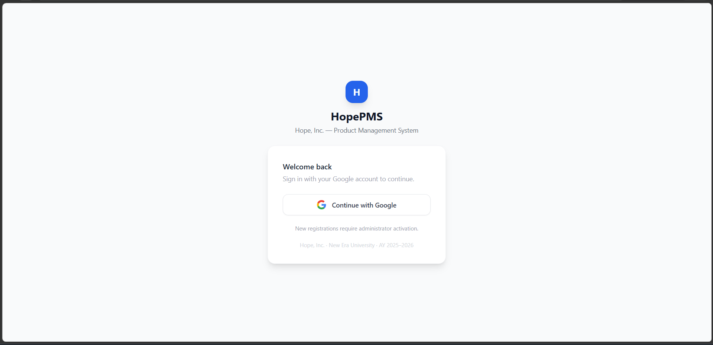

**After**  
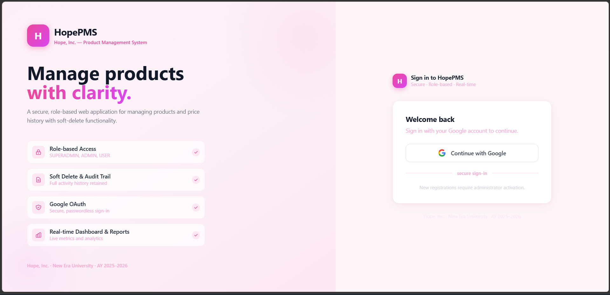

### Changes Made

#### `src/pages/LoginPage.jsx`
- Desktop split layout

#### New: `src/pages/LandingPage.jsx`
- Full-screen hero for mobile/tablet
- "Sign In" button navigates to `/login`
- Built-in guards:
  - Active session → redirect to `/products`
  - Desktop → auto redirect to `/login`

#### `App.jsx`
- `/` now points to `LandingPage`
- Catch-all route also redirects to landing page

---
**Made by:** Marlan Alfonso